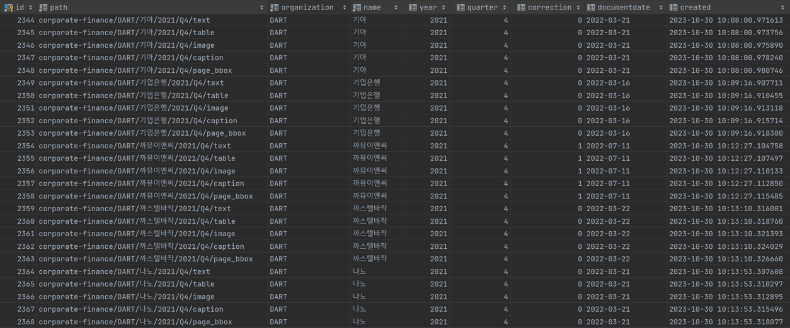
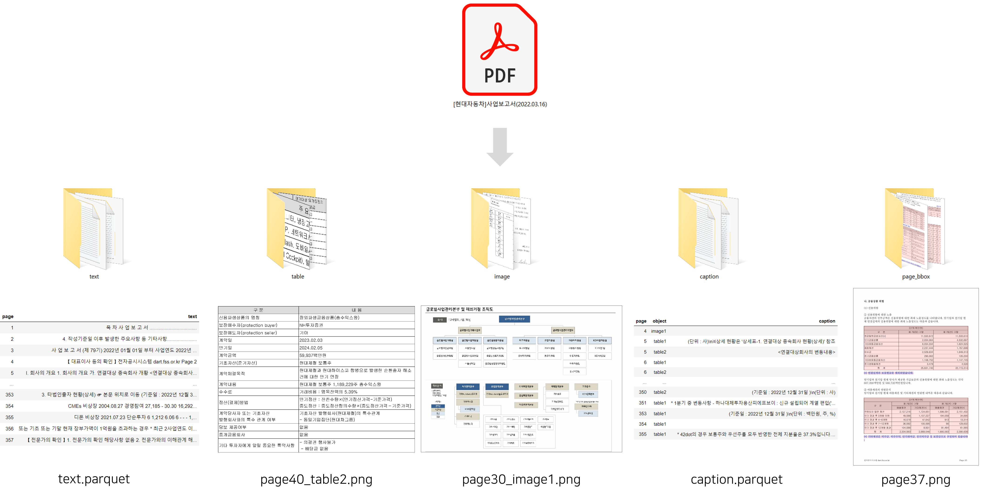
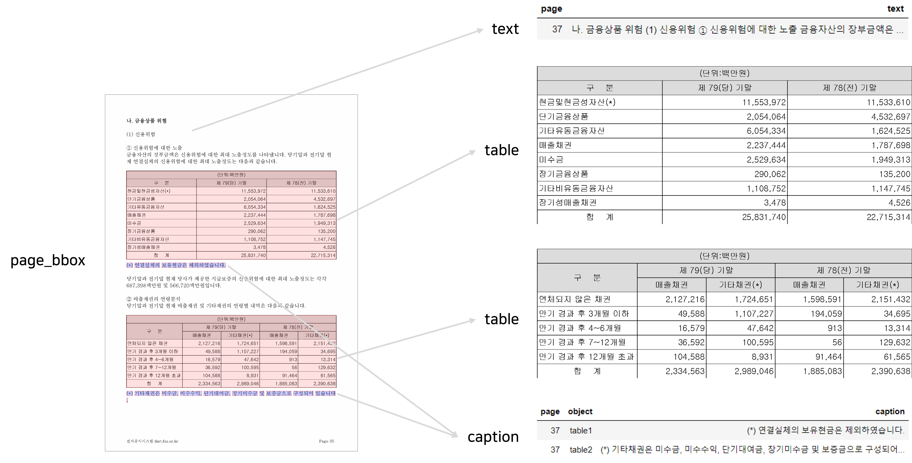

## Overview
- DART 기업보고서로부터 text, table, image, caption object 추출
- 추출한 결과를 로컬 또는 DB 서버에 저장
- DB 서버에 저장할 경우 메타데이터도 자동으로 추출하여 SQL 서버에 저장

#### Input
- DART 기업보고서 (분기/반기/사업보고서) (pdf 파일)

#### Output
- text (parquet 파일)
- table (png 파일)
- image (png 파일)
- caption (parquet 파일)
- page_bbox (png 파일)


## Usage
1. Requirements 설치
```sh
conda create -n dart python=3.9
conda activate dart
pip install -r requirements.txt
```
2. config.py에 정보 입력 (for SNU BDAI members)
3. Object를 추출하고자 하는 pdf 파일들 input 폴더에 복사
4. Object 추출
```sh
# 로컬 & DB 서버에 둘 다 저장
python main.py --page_bbox --save_local --save_db

# 로컬에만 저장
python main.py --page_bbox --save_local

# DB 서버에만 저장
python main.py --page_bbox --save_db
```


## Results
#### 메타데이터 추출 결과 예시
<p align="center">
  
</p>

#### Object 추출 결과 예시
<p align="center">
  
</p>

<p align="center">
  
</p>
